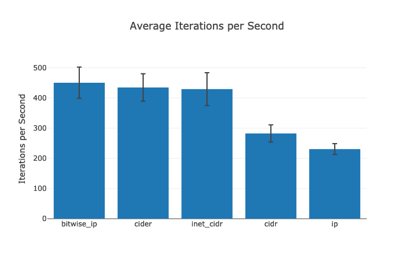
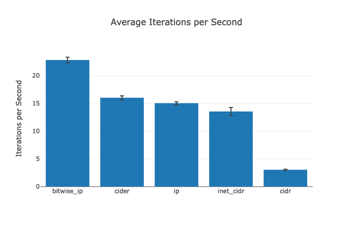

# BitwiseIp

[](https://github.com/ajvondrak/bitwise_ip/actions?query=workflow%3Abuild)
[](https://coveralls.io/github/ajvondrak/bitwise_ip?branch=main)
[](https://hex.pm/packages/bitwise_ip)
[](https://hexdocs.pm/bitwise_ip/)

This library provides a bitwise representation of IP addresses and efficient operations on top of them.

Whereas Erlang's [`:inet`](http://erlang.org/doc/man/inet.html) standard library represents IP addresses as tuples of integers like `{127, 0, 0, 1}`, bitwise\_ip encodes IP addresses as single integers. Using bitwise arithmetic then allows for an efficient implementation of [CIDR](https://en.wikipedia.org/wiki/Classless_Inter-Domain_Routing) blocks and their related operations - from parsing, to membership checks, to the whole [`Enumerable`](https://hexdocs.pm/elixir/Enumerable.html) protocol.

## Installation

Add `:bitwise_ip` to your list of dependencies in `mix.exs`:

```elixir
def deps do
  [
    {:bitwise_ip, "~> 1.0"}
  ]
end
```

## Usage

Full [API documentation](https://hexdocs.pm/bitwise_ip) is available on HexDocs.

The main data structures of this library are `BitwiseIp` and `BitwiseIp.Block`.

`BitwiseIp` represents an individual IP address. Different data types will need to be converted into their bitwise representations in different ways. An `:inet`-style tuple such as the `remote_ip` field of a [`Plug.Conn`](https://hexdocs.pm/plug/Plug.Conn.html) can be encoded using `BitwiseIp.encode/1`. Strings representations may be parsed using `BitwiseIp.parse/1` or `BitwiseIp.parse!/1`.

```elixir
BitwiseIp.parse!("127.0.0.1") == BitwiseIp.encode({127, 0, 0, 1}) #=> true
```

`BitwiseIp.Block` represents a CIDR block. A string in CIDR notation may be parsed using `BitwiseIp.Block.parse/1` or `BitwiseIp.Block.parse!/1`. The resulting struct implements the `Enumerable` protocol, so you may treat it as a collection of `BitwiseIp` structs.

```elixir
ip = BitwiseIp.parse!("127.0.0.1")
block = BitwiseIp.Block.parse!("127.0.0.0/8")

ip in block #=> true
```

The `BitwiseIp.Blocks` module lets you manipulate lists of blocks, particularly for IP membership checks.

```elixir
ip = {127, 0, 0, 1}
blocks = BitwiseIp.Blocks.parse!(~w[
    127.0.0.0/8
    ::1/128
    fc00::/7
    10.0.0.0/8
    172.16.0.0/12
    192.168.0.0/16
])

BitwiseIp.Blocks.member?(blocks, ip) #=> true
```

## Performance

Compared to other libraries that handle IP blocks, bitwise\_ip has a more efficient implementation when it comes to both parsing CIDR notation and doing IP membership tests. This is supported by data from the [benchmarks](bench), which use [benchee](https://hex.pm/packages/benchee) to calculate the average iterations per second in a fixed time span (so higher is better).

### Parsing

[[source]](bench/parse.exs)



### Membership

[[source]](bench/member.exs)



### Analysis

[inet\_cidr](https://hex.pm/packages/inet_cidr) is the most popular CIDR library, but its performance suffers because it uses tuples of integers to represent IP addresses. This means membership checks require more work, since there are separate bounds checks done for each tuple element. Each check requires an allocation of a `Range` struct and multiple integer comparisons. The parsing logic is also inefficient. For instance, it still has to perform bitwise arithmetic to extract the starting address of the block, but instead of using a single bitwise `AND`, the code does multiple bitwise `AND` operations for each individual tuple element.

[cidr](https://hex.pm/packages/cidr) similarly uses tuples of integers, but its implementation does significantly more work than inet\_cidr. The membership test does the same bounds checking to see if the addresses match, plus additional checks to make sure each element of the tuple is within the range of the IP byte/hextet (e.g., each tuple element of an IPv4 address has to be between 0 and 255). Parsing is also expensive: it first converts an `:inet`-style tuple to an integer, does some computations, converts the one integer back into a list of integers, then converts that list to a tuple. Furthermore, the `CIDR.match/2` & `CIDR.match!/2` interface is more awkward than an `Enumerable`-style interface.

[cider](https://hex.pm/packages/cider) uses the same type of integer representation as bitwise\_ip, but its implementation has some small details that add overhead. For instance, the membership check does an unnecessary XOR and compares the result to 0 instead of doing a direct integer comparison. More importantly, the library fails to distinguish between IPv4 and IPv6 addresses, leading to false positives for membership checks. This alone makes the library's logic incorrect, so performance is kind of immaterial.

[ip](https://hex.pm/packages/ip) has correct membership logic while using the single integer representation, but it doesn't follow through on using the appropriate bitwise arithmetic for its implementation. Instead of performing a single bitwise `AND` + integer comparison to test for membership, it does a bounds check requiring two integer comparisons against the starting & ending addresses of the block. Computing the block's endpoints then requires further bitwise arithmetic. The parser suffers from similar issues where it's doing redundant work. Additionally, the library lacks facilities for encoding `:inet`-style tuples.

The place where the performance gains of bitwise\_ip might wash out is encoding `:inet`-style tuples. In particular, avoid re-encoding the same tuple repeatedly in hot loops. This is a common enough pattern that the `BitwiseIp.Blocks.member?/2` function exists to avoid the problem.
